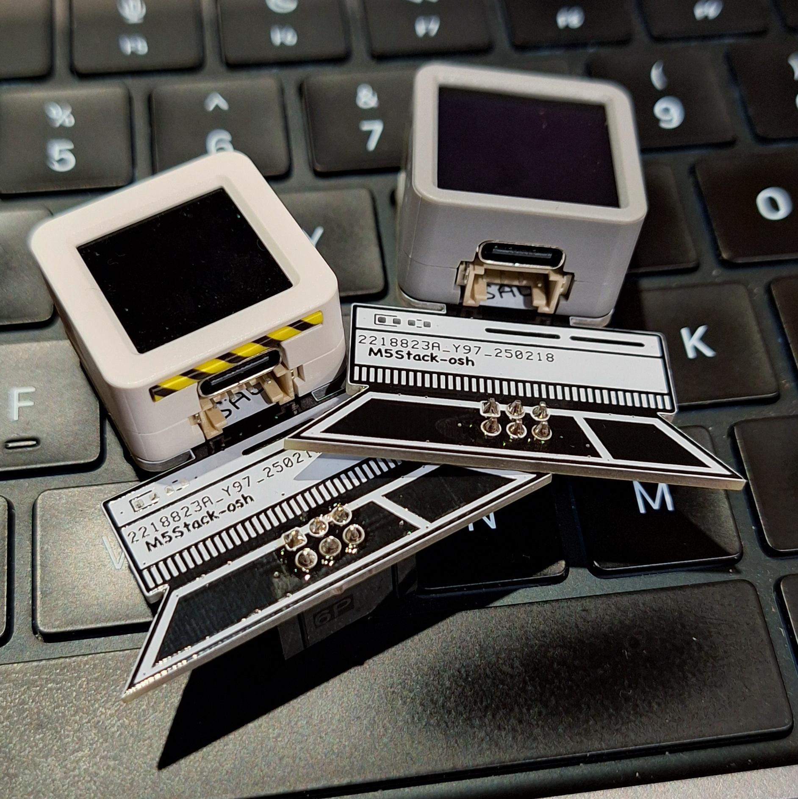
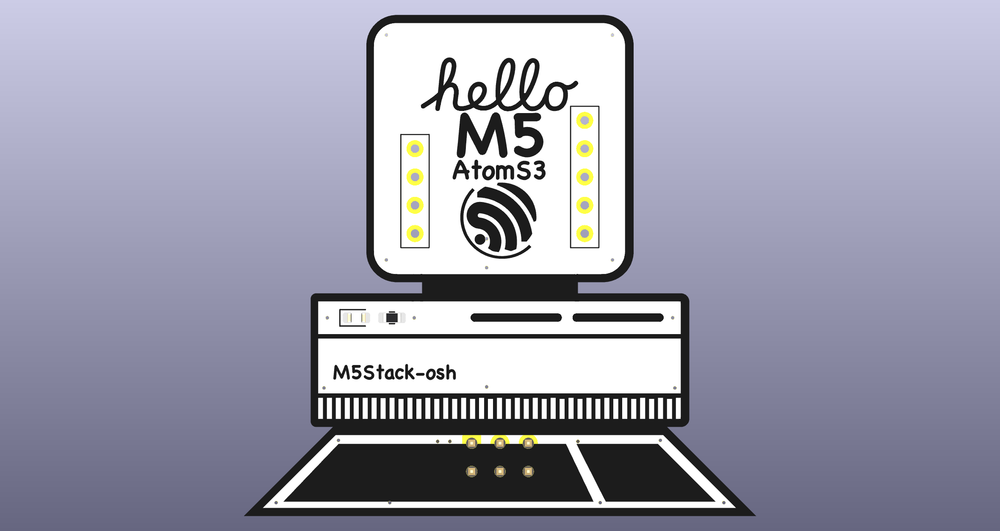
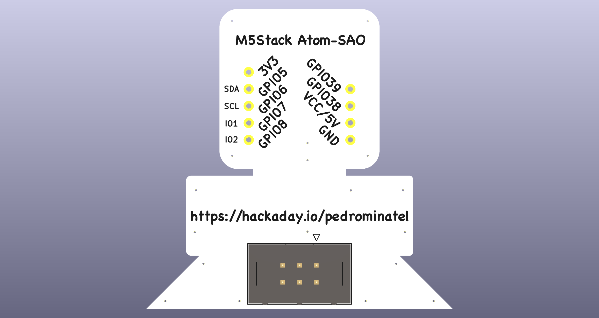

# Hackaday SAO M5Stack Atom

This is the initial design for a SAO board for the [2025 Hackaday Conference Europe](https://hackaday.com/2025/01/14/hackaday-europe-2025-tickets-on-sale-and-cfp-extended-until-friday/) in Berlin.

This board was designed on KiCad v9.

## Overview

This SAO compatible board is based on the Apple Macintosh II for the [M5Stack AtomS3](https://docs.m5stack.com/en/core/AtomS3) (also compatible with any Atom).

### First Version for the Hackaday Conference Europe§

### Front

### Back

